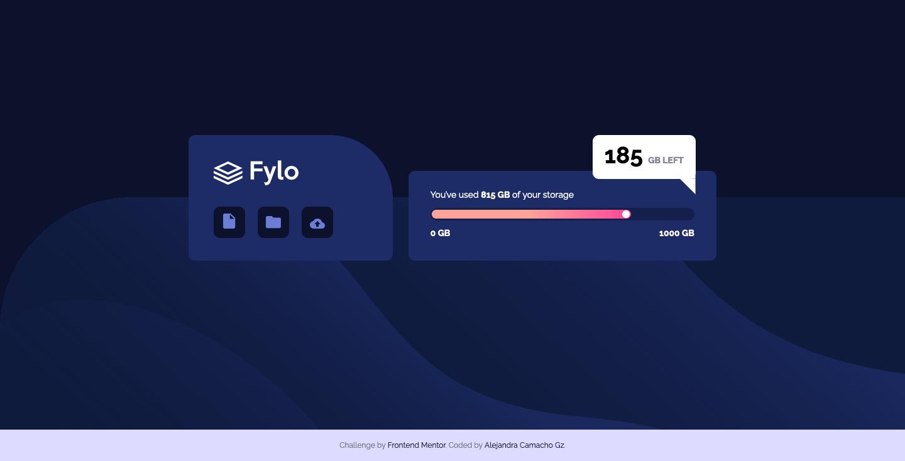
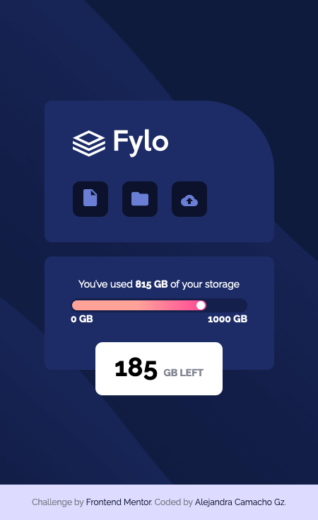

# Fylo Data Storage component

## ✍🏻 Description
This is a challenge from [Frontend-Mentor](https://www.frontendmentor.io/). I improved my CSS skills with this challenge and I am very proud of the final result.

## 🚀 Getting Started
Only you need download the project and open index.html. That's it.

You can see the result here → [Data Storage Component](http://alejandra-camacho.me/Fylo-data-storage-component/)

## 🎨 Preview

    
🖥 Desktop version

    
📱 Mobile version

## 👩🏻‍💻 Technologies
1. HTML
2. CSS
3. Stylus
